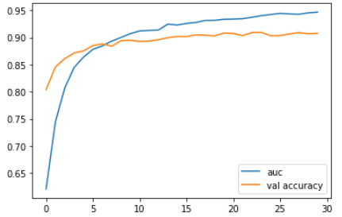
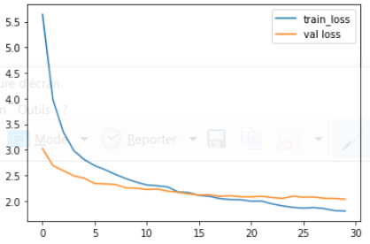
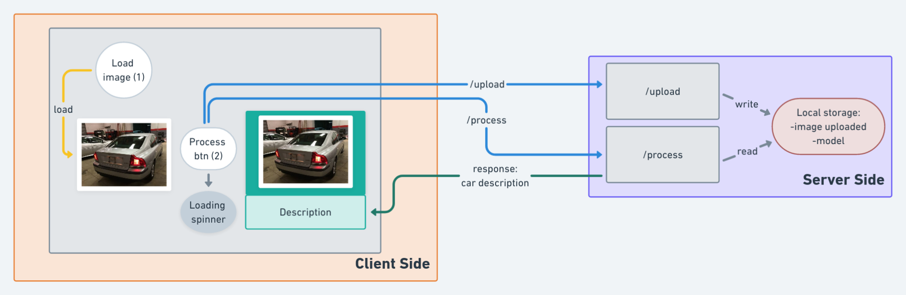

## Project Description : 

In this project we created a web application which is able to recognize the brand and the model of any car that appears in an image.


## Prerequisites: 

In order to use the classification app, you have to install Python 3.6, create a virtual environment and install all the dependencies in the file requirements.txt.
* Install python 3.6.9  

* Install pip :   
```python -m pip install --upgrade pip ```

* Create and activate a virtual environment :
https://uoa-eresearch.github.io/eresearch-cookbook/recipe/2014/11/26/python-virtual-env/

```
pip install -r requirements.txt
 ```
Or you can manually install the following python libraries :

    * flask
    * tensorflow
    * keras
    * matplotlib
    * numpy
    * opencv  
    * pandas
    * distutils
  
## Train Results

_Dataset_ :

For the purpose of this project we used for each class, a name which represents the Car Model while the first word represents the Car Brand, there are in total 28 classes of Car Brands and 56 classes of Car Models.  

It was split to: 80% training set and 20% validation set.

PS: This repo contains only 4 classes of Car Models and 2 classes of Car Brands.  

**Sample Car Brand & Car Model**  
* Car Brand:  
Audi  
BMW  
* Car Model:  
audi_a4_2006
bmw_325i_2003


_Model_ :  VGG16 

_Method_ :  _Transfer Learning_ :  

Take layers from the previously trained model:    .
Freeze them, add some new trainable layers on top of the frozen layers. so they learn to turn the old features into predictions on the new dataset.

_Scripts_:  
To train the model we used the script : **model.py**
To display the model predictions we used the script : **test_model.py**

_Performance analysis_ :   

<p float="left">
  
   

</p>

## How it works:




The user clicks on the button **upload** and chooses an image which contains a car or multiple cars and it's immediatly displayed in the web application. (frontend-backend)  

When the user clicks on the button **process** the image will be sent to the server to be processed by the classification model and the result would be the brand and the model of the car(s) shown in the input image.

# Usage:

* Run the application :  
Use the app.py file in order to test the web application.

   ``` > python app.py ```

PS : To be able to run the web application properly, start by running the model.py script to generate the model (vgg.h5) and save it in a folder named model that should exist in the folder named app.  

_Example usage_:

  


